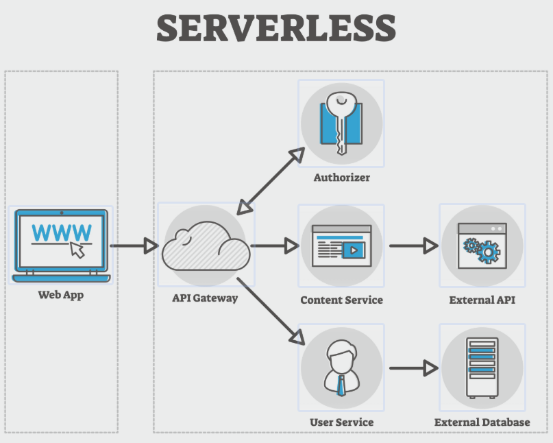

# SecureChat v2.0

基于 Python 的安全聊天系统，集成了多种密码学技术。

## 功能特性
1. **AES 端到端加密聊天** (E2EE)
2. **可搜索加密** (SSE)
3. **隐匿查询** (PIR)
4. **隐私计算** (同态加密薪资统计)
5. **安全认证** (加盐哈希登录)

## 运行方式
1. 安装依赖: `pip install -r requirements.txt`
2. 启动服务端: `python -m server.chat_server`
3. 启动客户端: `python -m client.client_gui`

